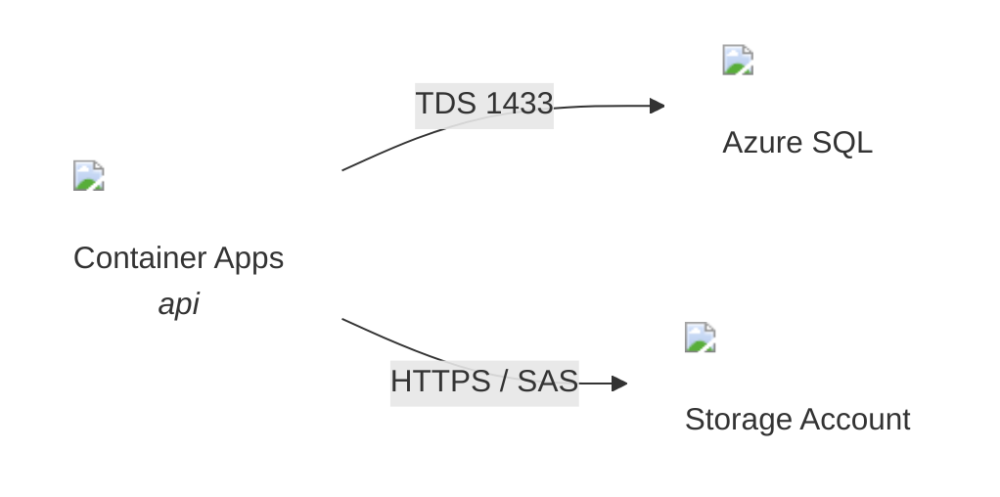

# Mermaid — Icons in the Node Label

**Version:** v1.0.0
**Updated:** 2026-06-17

L2 leaf. Placing resolved ByteAid Assets SVGs inside a mermaid flowchart. Slug resolution + verification live in `byteaid-assets-icons`; the diagram-level rules (icon-is-the-node, edges carry protocol) live in [SKILL.md](SKILL.md). Resolve and verify `200` BEFORE embedding.

## `` in the node label

Mermaid flowcharts render HTML labels by default (`htmlLabels: true`); an `` pointing at the icon's `svgUrl` works directly:

````markdown

````

Conventions:

- **The icon IS the node** — suppress the enclosing box with `classDef icon fill:none,stroke:none` and apply it to every icon-bearing node ([SKILL.md](SKILL.md) rule 1). Keep boxes only for `subgraph` groupings and icon-less actors.
- `width='36'` is the standard node-icon size (source viewBox `0 0 18 18`, scales cleanly). Use `24` for dense diagrams.
- Label pattern: icon, `<br/>`, service display name, optional `<br/><i>{role}</i>`.
- Quote the whole label (`id["..."]`) and use single quotes inside the HTML attributes.
- Edges carry protocol/port text; icons go on nodes only ([SKILL.md](SKILL.md) rule 3).

## Renderer caveats

| Renderer | External `` in labels |
|---|---|
| Mermaid Live, VS Code preview, mkdocs-material, most embedded mermaid.js | Works (default `htmlLabels: true`; DOMPurify allows `img`). |
| **GitHub.com markdown** | **Stripped** — GitHub sanitizes external images inside mermaid. Diagram still renders, icons silently disappear. |
| `securityLevel: 'antiscript'/'sandbox'` hosts | May drop HTML labels entirely. |

If the artifact's primary consumption surface is GitHub.com, say so and either keep the icon-less mermaid as the source of truth or render the iconful diagram to an image (e.g. `mmdc -i topology.mmd -o topology.svg`) and embed that — or switch to the Typst target ([typst-fletcher.md](typst-fletcher.md)).
