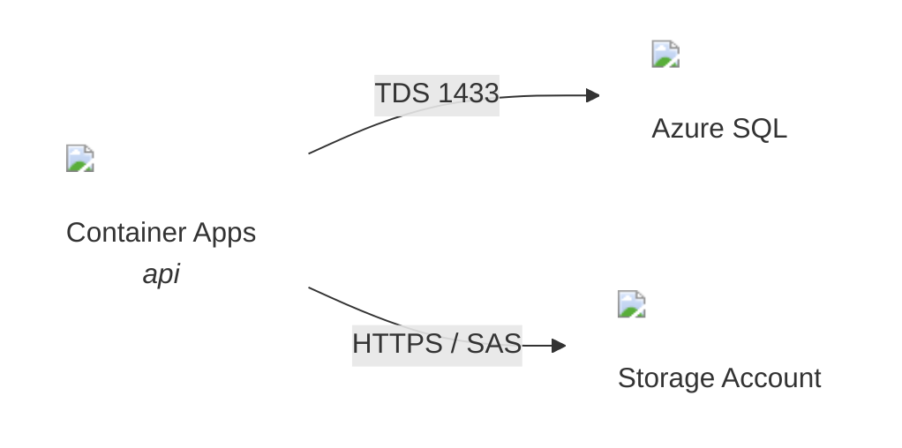

# Embedding Recipes — Icons in Mermaid and Typst

**Version:** v1.0.0
**Updated:** 2026-06-04

L2 leaf. How to place resolved ByteAid Assets SVGs inside diagrams. Slug resolution rules live in [SKILL.md](SKILL.md) — resolve and verify BEFORE embedding.

## Mermaid — `` in the node label

Mermaid flowcharts render HTML labels by default (`htmlLabels: true`); an `` pointing at the `svgUrl` works directly:

````markdown

````

Conventions:

- **The icon IS the node** — suppress the enclosing box with `classDef icon fill:none,stroke:none` and apply it to every icon-bearing node; a drawn border around the SVG duplicates its silhouette and wastes space. Keep boxes only for `subgraph` groupings and icon-less actors.

- `width='36'` is the standard node-icon size (source viewBox is `0 0 18 18`, scales cleanly). Use `24` for dense diagrams.
- Label pattern: icon, `<br/>`, service display name, optional `<br/><i>{role}</i>`.
- Quote the whole label (`id["..."]`) and use single quotes inside the HTML attributes.
- Edges carry protocol/port text; icons go on nodes only.

### Renderer caveats

| Renderer | External `` in labels |
|---|---|
| Mermaid Live, VS Code preview, mkdocs-material, most embedded mermaid.js | Works (default `htmlLabels: true`; DOMPurify allows `img`). |
| **GitHub.com markdown** | **Stripped** — GitHub sanitizes external images inside mermaid. Diagram still renders, icons silently disappear. |
| `securityLevel: 'antiscript'/'sandbox'` hosts | May drop HTML labels entirely. |

If the artifact's primary consumption surface is GitHub.com, say so and either keep the icon-less mermaid as the source of truth or render the iconful diagram to an image (e.g. `mmdc -i topology.mmd -o topology.svg`) and embed that.

## Typst — download first, then `#image`

Typst has **no network access**: `#image("https://...")` fails. Download every needed SVG into an asset folder next to the `.typ` file, then reference locally. The examples below use `icons/`; a host procedure may mandate its own layout (e.g. `generate-azure-solution-proposal` requires downloaded resources under `.assets/icons/`) — follow the host's layout and adjust the paths accordingly.

```bash
mkdir -p icons
for slug in container-apps-environments azure-sql storage-accounts; do
  curl -sf -o "icons/$slug.svg" "https://assets.byteaid.io/api/icons/azure/$slug.svg" || echo "MISS: $slug" >&2
done
```

```powershell
New-Item -ItemType Directory -Force icons | Out-Null
'container-apps-environments','azure-sql','storage-accounts' | ForEach-Object {
  Invoke-WebRequest "https://assets.byteaid.io/api/icons/azure/$_.svg" -OutFile "icons/$_.svg"
}
```

Helper + usage:

```typst
// one helper per document; slug = the resolved ByteAid slug
#let azicon(slug, size: 18pt) = image("icons/" + slug + ".svg", width: size)

// inline next to a service name
#azicon("storage-accounts") Storage Account

// as a labeled node block (tables, grids, or fletcher diagram nodes)
#let svc(slug, name, role: none) = align(center)[
  #azicon(slug, size: 28pt) \
  #text(weight: "bold", size: 9pt)[#name]
  #if role != none [ \ #text(size: 8pt, style: "italic")[#role] ]
]
```

With `fletcher` (typical Typst diagram package), pass `svc(...)` as the node body. **The icon IS the node — never draw a box/circle around it.** Set `node-stroke: none` and `node-fill: none` at the diagram level so the SVG stands directly with its label below; an enclosing shape duplicates the icon's own silhouette and wastes diagram space. Reserve stroke/fill for `enclose:` grouping nodes (regions, zones) and for non-Azure actors that have no icon:

```typst
#import "@preview/fletcher:0.5.7": diagram, node, edge
#diagram(
  node-stroke: none,            // icons stand directly — no enclosing shape
  node-fill: none,
  node((0,0), svc("container-apps-environments", "Container Apps", role: "api"), name: <aca>),
  node((2,0), svc("azure-sql", "Azure SQL"), name: <sql>),
  node((4,0), [Client], stroke: 0.5pt, fill: rgb("#f7fafb"), corner-radius: 10pt, name: <user>),  // icon-less actor keeps a shape
  edge(<aca>, <sql>, "->", [TDS 1433]),
)
```

(`shape:` in fletcher takes a function, not a string — `shape: "pill"` is a compile error; use `corner-radius` or import `fletcher.shapes`.)

Conventions:

- `icons/` lives beside the `.typ`; commit the SVGs with the document so compilation is reproducible offline.
- `curl -sf` (fail on HTTP error) so a bad slug aborts loudly instead of writing an HTML error page into the `.svg` — Typst's error for a corrupt SVG is cryptic.
- Standard sizes: `18pt` inline, `28pt` diagram node.

## Checklist (any diagram, either target)

1. Every Azure service node has an icon; non-Azure actors (users, external SaaS) may go icon-less or use a neutral shape.
2. Every slug was resolved via the API this session and verified `200` (SKILL.md rules 1, 2, 5).
3. One slug per service across the whole artifact (rule 4).
4. Typst: all referenced files exist under `icons/` and compile (`typst compile` exits 0) — when the `typst` CLI is unavailable, state that compilation is unverified.
