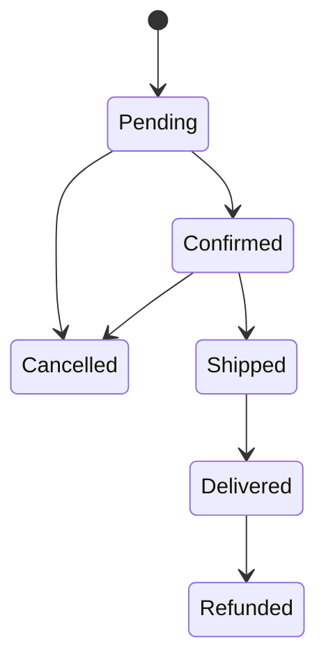
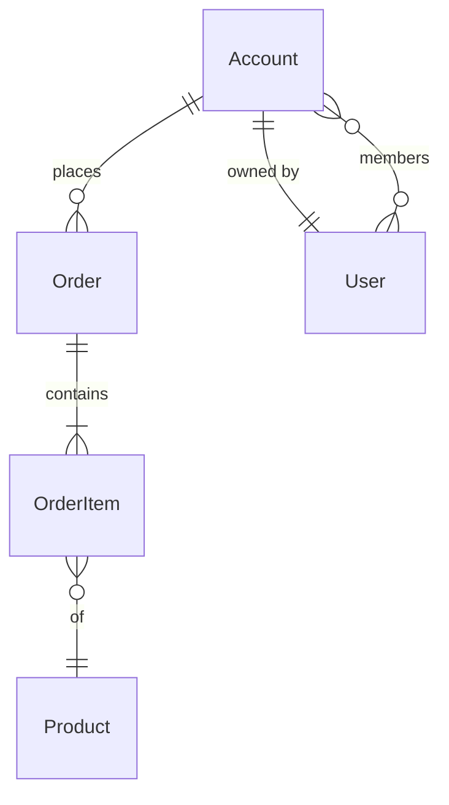

# DATA-MODEL — `docs/DATA-MODEL.md`

## Purpose

The structural view of the product: which domain entities exist, which value objects describe their state, and how they are related (cardinality, ownership, lifecycle). Every entity named here is also defined in `docs/GLOSSARY.md`; this document adds the *shape* and *connections* the glossary deliberately leaves out.

It is read by: the analyst (to keep entity vocabulary consistent across features), the architect (to design the persistence layer and pick storage technologies), the developer (to choose property names and relationships), the test-designer (to know what state to seed for each flow), the reviewer (to flag duplicated or ambiguous models in the codebase).

## Owner

The **analyst** role produces and maintains `docs/DATA-MODEL.md`. Persistence-shape decisions (table layout, partition keys, JSON shapes, denormalisation) are NOT in this file — they belong to `docs/SOLUTION.md` (architect). The data model is the conceptual layer; SOLUTION translates it into a chosen technology.

## Location

`docs/DATA-MODEL.md` — UPPERCASE, at the repo root's `docs/` folder. Git-tracked. One file per project.

## Shape

```markdown
# Data Model

> Conceptual structure of {Product}. Every entity below also has a glossary entry. Persistence choices live in `docs/SOLUTION.md` (architect).

## Entities

### Account
The billable customer record. See glossary entry `Account`.

| Field | Type | Notes |
|---|---|---|
| `AccountId` | Guid v7 (PK) | Primary identifier. |
| `Name` | string | Display name. |
| `OwnerId` | Guid v7 (FK → User) | Required, exactly one. |
| `CreatedAt` | Instant | Set by `TimeProvider`. |
| `Status` | `AccountStatus` enum | See enum block below. |

**Invariants:**
- An Account has exactly one Owner at all times.
- An Account cannot be deleted while it has any `Active Order`.

### Order
A customer-placed order. See glossary entry `Order`.

| Field | Type | Notes |
|---|---|---|
| `OrderId` | Guid v7 (PK) | |
| `AccountId` | Guid v7 (FK → Account) | Required. |
| `Status` | `OrderStatus` enum | Lifecycle: see state diagram below. |
| `Total` | Money | Currency + amount; recomputed on item change. |

...

## Value objects

### Money
Composite of `Currency` (ISO 4217) + `Amount` (decimal, 4-digit precision). Immutable; equality by value.

### Address
... 

## Enums

### AccountStatus
`Active`, `Suspended`, `Closed`. Transitions:
- `Active → Suspended` (admin action)
- `Suspended → Active` (admin action)
- `Active → Closed` (owner action; one-way)

### OrderStatus
`Pending → Confirmed → (Shipped | Cancelled) → (Delivered | Refunded)`



## Relationships



## Cross-cutting concerns

- **Identifiers.** Every entity PK is a Guid v7 (`Guid.CreateVersion7()`); no `int` autoincrement.
- **Timestamps.** Every entity has `CreatedAt` (`Instant`, from `TimeProvider`); mutable entities also carry `UpdatedAt`.
- **Tenancy.** {if applicable} Every row of a multi-tenant entity carries `TenantId`. Cross-tenant joins are forbidden.
- **Soft delete vs hard delete.** {project policy}.
```

## Sections

The file is organised in this fixed order:

| Section | Purpose |
|---|---|
| **Entities** | One subsection per entity. Field table + Invariants. Every entity name matches a glossary entry. |
| **Value objects** | Immutable composites. Lighter shape — usually one paragraph + an equality note. |
| **Enums** | Closed sets. List values; if a state machine exists, document the legal transitions and provide a Mermaid `stateDiagram-v2`. |
| **Relationships** | A single Mermaid `erDiagram` covering all entities. Cardinality is explicit (`||--o{`, `}o--o{`, etc.). |
| **Cross-cutting concerns** | Identifiers, timestamps, tenancy, soft-delete policy — rules that apply across the model. |

## Rules

- **Conceptual, not physical.** No mention of tables, columns, indices, partition keys, document collections, materialised views — those live in `docs/SOLUTION.md`. If the data model says "FK → User", the architect picks how that constraint is realised in the chosen storage.
- **Every entity matches a glossary entry.** Adding an entity to the data model requires the matching glossary entry first (analyst writes both, in the same slice).
- **Invariants are explicit.** Anything that "must always be true" (Account has exactly one Owner; Order Total equals sum of OrderItem subtotals) is listed under the owning entity's Invariants bullet.
- **Mermaid renders.** ER diagrams use the `erDiagram` syntax; state machines use `stateDiagram-v2`. They MUST render in standard GitHub / GitLab viewers — no rendering hacks, no images.
- **No history.** As with every other state doc: when a field is renamed or an entity is split, the diagrams and tables are rewritten in place. Motivation lives in the commit message.

## Bootstrap

- **Variant a / b / c1 / existing-code-greenfield-docs**: the analyst seeds `docs/DATA-MODEL.md` after `docs/REQUIREMENT.md` exists, by extracting the nouns from each FR and grouping them. The minimal v1 has every entity referenced by an FR plus its closest relationships.
- **Variant c2 / c3**: skip.
- **Migration from legacy monolithic docs**: the analyst extracts entities from legacy `REQUIREMENT.md` + (if present) the data section of `ARCHITECTURE.md`. The persistence specifics from `ARCHITECTURE.md` move into `docs/SOLUTION.md` (architect handles that half).

## Audit checklist (run on every save)

- [ ] Every entity name has a glossary entry.
- [ ] Every cited `FR-NNN` / `FT-NNN` reference resolves.
- [ ] Mermaid `erDiagram` renders; cardinalities are explicit.
- [ ] No "Deprecated" / "Old schema" / "Legacy field" sections.
- [ ] No persistence-implementation details (tables, indices, partition keys, EF Core fluent API snippets). Those belong to SOLUTION.md.

## See also

- [glossary.md](glossary.md) — every entity here also has a glossary entry.
- [solution.md](solution.md) — the physical realisation (storage technology, schemas, partitioning).
- [requirement.md](requirement.md) — the FRs whose nouns this model expresses.
- [skill.md](skill.md) — master table of canonical docs and owners.
