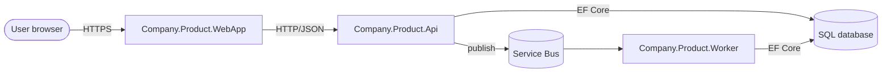

# Solution document — `docs/SOLUTION.md`

## Purpose

SOLUTION.md answers: *what infrastructure runs this product, which apps does it consist of, how do they communicate, and how much does it cost?* It is the unified HOW document — what was previously split between `SOLUTION.md` (the picks) and `ARCHITECTURE.md` (the wiring) is now consolidated into one file. ARCHITECTURE.md was retired in v0.4.0 of this skill.

It is read by: the user / sponsor (to approve the spend and the optimisation stance), the architect (to keep the solution consistent as features evolve), the developer (to know where to add code), the test-designer (to know which surfaces to exercise).

## Owner

The **architect** role produces and maintains SOLUTION.md. The architect replaced the previous `planner` role in v0.4.0 and absorbed the ARCHITECTURE responsibilities. The owner verifies vendor pricing in the same session as authoring — never delivers SOLUTION.md with placeholder costs.

## Where

- Path: `docs/SOLUTION.md`.
- Tracked: yes (git).
- Lifecycle: desired state — **rewritten in place** when components, communication, or costs change. No history sections, no Decisions log, no `(superseded …)` annotations. Reason for changes lives in commit messages.

## What goes in

- **Optimisation mode:** explicit tag — `COST-FIRST`, `SECURITY-FIRST`, `PERFORMANCE-FIRST`, or another team-defined axis. Every selection below is filtered through this lens.
- **Constraints:** budget ceilings, deadlines, regulatory obligations, vendor lock-in tolerance, on-prem-only restrictions.
- **Apps:** every deployable unit — WebApp, WebApi, Worker, gRPC service, CLI, scheduled job, etc. — with the runtime, the role each plays, the FT-NNN it serves.
- **Communication:** how the apps talk to each other (HTTP, gRPC, message bus, scheduled events). Sequence diagrams allowed for non-trivial interactions.
- **Infrastructure:** managed services / vendors / runtimes the apps depend on (database, cache, identity, messaging, observability, CDN). One row per component class.
- **Data model:** entities and their key fields. Stack-agnostic; the implementing technology adds its own concrete schema.
- **Environment strategy:** dev / staging / prod differences at the abstract level — secret handling, isolation, observability, scaling.
- **Cost estimate:** line-item monthly (or per-period) cost, dated, totalled. Source per line.
- **What is included vs excluded:** explicit lists. Excluded items get an upgrade path and a cost delta.
- **Risk register:** top risks with impact and mitigation.

## What does NOT go in

- Functional or non-functional requirements — those live in [requirement.md](requirement.md).
- Per-feature detail or per-flow detail — those live under `docs/features/`.
- Per-iteration task decomposition — that lives in the operational `todo.md` (temp folder).
- Per-iteration cost actuals — track those in the project's ops dashboards; SOLUTION.md carries the planning estimate.
- Decisions log, history, supersession trails — git log is the historical archive.

## Format

```markdown
# {Product / feature name} — Solution

> One-line summary of the chosen solution.

## Optimisation mode

**COST-FIRST | SECURITY-FIRST | PERFORMANCE-FIRST** — {one sentence on the trade-off stance}.

## Constraints

- Budget: {amount / cap}
- Deadline: {date / "none"}
- Regulatory: {standards / "none"}
- Vendor lock-in tolerance: {high / low / specific bans}

## Apps

| App                          | Type      | Runtime / Tech       | Role                                       | Serves          |
|------------------------------|-----------|----------------------|--------------------------------------------|-----------------|
| Company.Product.WebApp       | WebApp    | Blazor on .NET 10    | Customer-facing UI                         | FT-001, FT-002  |
| Company.Product.Api          | WebApi    | ASP.NET Core 10      | HTTP API consumed by WebApp + mobile       | FT-001..FT-003  |
| Company.Product.Worker       | Worker    | .NET 10 hosted service | Async order processing, retry, dead-letter | FT-002          |
| Company.Product.AdminCli     | CLI       | .NET 10 + System.CommandLine | Operator workflows                | FT-004          |

## Communication



| Edge                       | Protocol | Auth         | Notes                              |
|----------------------------|----------|--------------|------------------------------------|
| Browser → WebApp           | HTTPS    | cookie       | TLS terminated at CDN              |
| WebApp → Api               | HTTPS    | JWT bearer   | mTLS in prod, plain HTTP in dev    |
| Api → SQL                  | TDS      | managed identity | private endpoint               |
| Api → Service Bus          | AMQP     | managed identity | publish only                   |
| Service Bus → Worker       | AMQP     | managed identity | one topic per event type       |

## Infrastructure

| Component        | Role                  | Chosen tech              | Rationale (under COST-FIRST)          |
|------------------|-----------------------|--------------------------|----------------------------------------|
| Compute (apps)   | Run apps              | Azure Container Apps     | scale-to-zero off-hours                |
| Persistence      | OLTP store            | Azure SQL Basic          | cheapest tier that meets NFR-003       |
| Messaging        | Async fan-out         | Azure Service Bus Std    | needed for topics                      |
| Identity         | User auth             | Microsoft Entra External | first 50k MAU free                     |
| Observability    | Logs + metrics + traces | App Insights           | bundled with Azure                     |

## Data model

### Order

| Field        | Type        | Required | Notes                                  |
|--------------|-------------|----------|-----------------------------------------|
| Id           | identifier  | yes      | GUID v7, system-generated              |
| CustomerId   | identifier  | yes      | references Customer                    |
| Total        | money       | yes      | non-negative                           |
| Status       | enum        | yes      | pending / confirmed / fulfilled / cancelled / failed |
| CreatedAt    | timestamp   | yes      | UTC                                    |

### Customer

| Field   | Type       | Required | Notes                          |
|---------|------------|----------|---------------------------------|
| Id      | identifier | yes      | GUID v7, system-generated      |
| Email   | string     | yes      | RFC 5322                       |

## Environment strategy

| Environment | Purpose                  | Notes                                              |
|-------------|--------------------------|----------------------------------------------------|
| dev         | local development        | Aspire-orchestrated emulators, sample identity     |
| ci          | automated verification    | identical to dev, no external state                |
| staging     | pre-prod                  | full external dependencies, reduced capacity       |
| prod        | live                      | full external dependencies, full capacity          |

Secret handling: no secrets in source; values come from the platform's secret store, resolved via the deploy pipeline. Local dev uses developer-personal secret stores.

## Cost estimate

> All figures dated 2026-05-16. Source links per line.

| Line             | Tier / SKU            | Quantity   | Cost / month (USD) | Source |
|------------------|------------------------|------------|--------------------|--------|
| Container Apps   | Consumption            | 4 apps     | 18                 | {url}  |
| SQL              | Basic 2 GB             | 1          | 5                  | {url}  |
| Service Bus      | Standard               | 1 ns       | 10                 | {url}  |
| App Insights     | Pay-as-you-go          | ~3 GB/mo   | 8                  | {url}  |
| **Total**        |                        |            | **41**             |        |

## What is included

- {Capability and why}

## What is excluded (with upgrade path)

- {Capability} — excluded because {reason}. Upgrade path: {how to add it later} — delta {cost / effort}.

## Risk register

| Risk                                  | Impact                                      | Mitigation                                                  |
|---------------------------------------|---------------------------------------------|--------------------------------------------------------------|
| Service Bus latency spike at burst    | Worker falls behind; user sees stale orders | Auto-scale rules on Worker; circuit breaker in API publisher |
| SQL Basic 2 GB cap                    | Catalog growth halts writes                 | Migrate to Standard tier (delta $25/mo) before 80% utilisation |
```

## Lifecycle

- **Created** at project bootstrap (variant `a` or `c1`) after the first features are sketched.
- **Updated in place** when (a) a new app is added / removed, (b) a communication edge changes, (c) a vendor / component is replaced, (d) cost numbers refresh, (e) the optimisation mode changes (rare — usually triggers a re-design).
- **Cost figures are dated.** Every refresh updates the date stamp on the cost section. The commit message records what changed and why.
- **Excluded items must carry an upgrade path.** "We did not buy WAF" is incomplete; "We did not buy WAF — upgrade by enabling tier X for additional Y per month" is the right shape.
- **Closed when** the product is closed. The file is never deleted.

## Rules

- **No history sections, no Decisions log, no `(superseded …)` annotations.** Pure desired state. Use `git log` to recover the past.
- **Compact — SOLUTION.md is the HOW index, not a deep-dive vault.** Keep it within the ≤ ~400-line compactness budget (SKILL § hard rule 10). Each section is a summary plus a table; anything that grows into a multi-page treatment (a detailed auth design, a partitioning scheme, a sequence-by-sequence protocol spec) moves to a referenced sub-doc under `docs/solution/` and is linked from the relevant section — never inlined. Per-feature / per-flow detail never belongs here at all; it lives under `docs/features/`. The architect re-reads this file on every plan and SOLUTION pass, so bloat is paid on every dispatch. A SOLUTION.md over budget is a `bloated-docs` condition — decompose it per [bootstrap.md](bootstrap.md) § Variant `bloated-docs` before planning further work.
- **One canonical SOLUTION.md per product.** Sub-docs (`AUTH_DESIGN.md`, `DATA_PARTITIONING.md`) may exist for deep dives and be referenced from here, but they never replace this file.
- **Mermaid diagrams must render in standard markdown viewers** (GitHub, GitLab, common static-site generators). Keep node identifiers ASCII; quote labels with spaces.
- **Verify pricing in the same session** as authoring or refreshing the Cost estimate. Stale / placeholder costs are not acceptable.

## IDs

- This document defines no IDs of its own. It references:
  - `FR-NNN` / `NFR-NNN` to justify components.
  - `FT-NNN` to map apps and edges to features.

## See also

- [requirement.md](requirement.md) — the FRs / NFRs each component satisfies.
- [feature.md](feature.md) — the features each app serves.
- [flow.md](flow.md) — the routes the apps realise.
